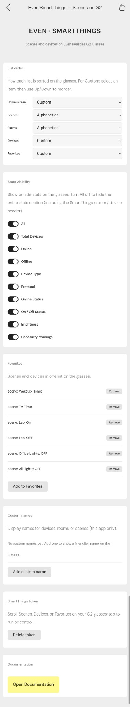
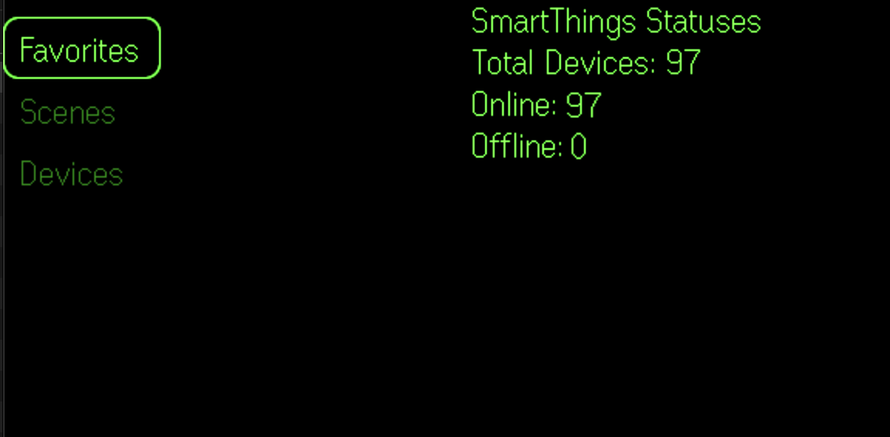
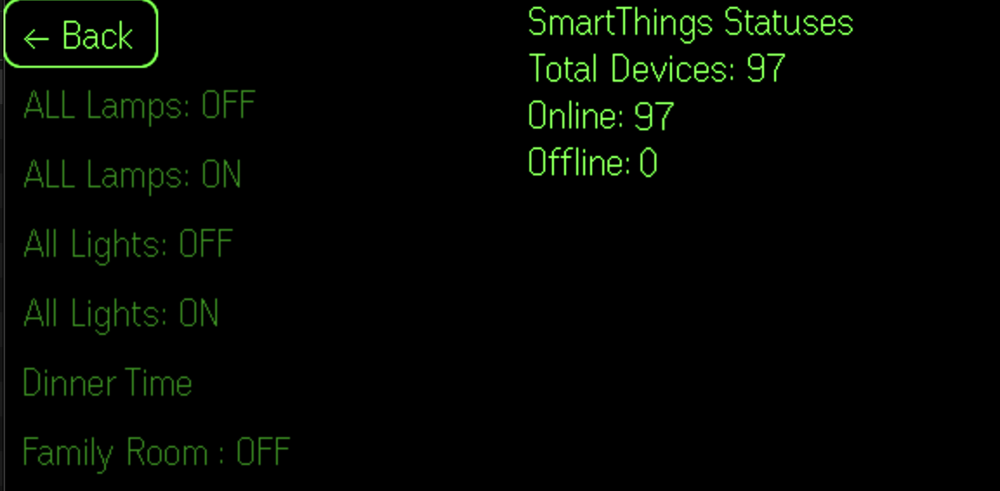
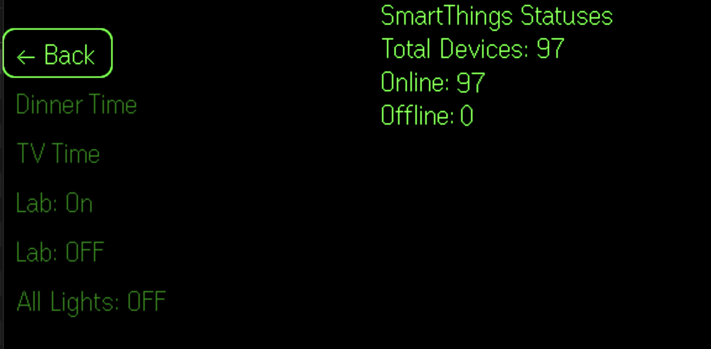
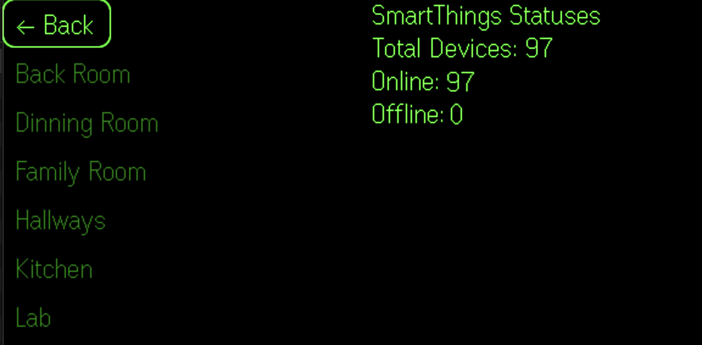
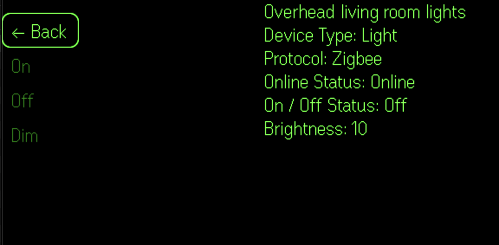
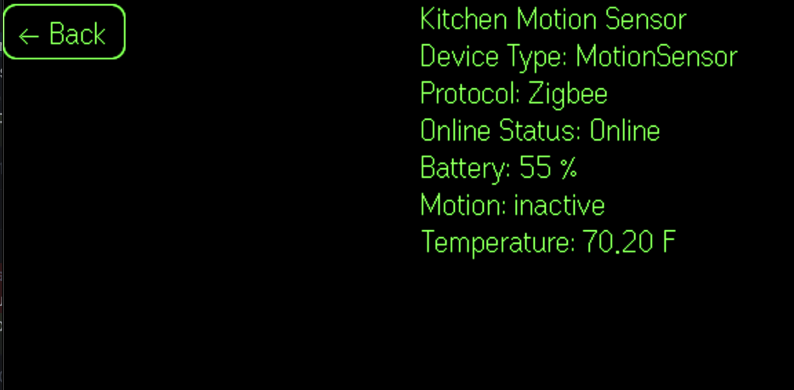
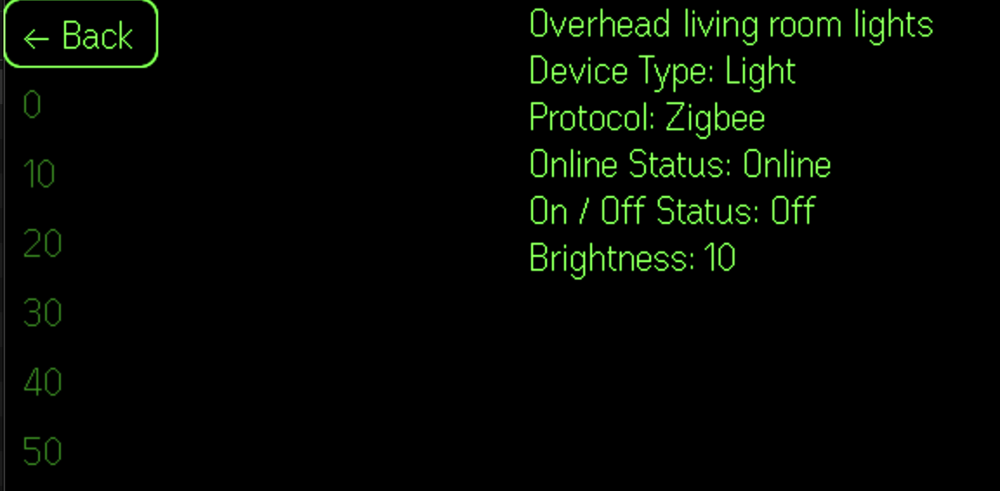

# Even SmartThings

**Control SmartThings from your Even Realities G2 glasses.** Browse scenes, devices, and rooms in a list—scroll to select, tap to run or toggle. Set your token, list order, favorites, and custom names in the config panel (Even App or browser), then use the widget on your glasses.

### Screenshots

| Config panel | Main menu (Favorites) | Scenes |
|--------------|------------------------|--------|
| [](screenshots/config.png) | [](screenshots/main-screen.png) | [](screenshots/scenes.png) |

| Favorites list | Rooms | Devices (lights) |
|-----------------|-------|-------------------|
| [](screenshots/favorites.png) | [](screenshots/rooms.png) | [](screenshots/devices-lights.png) |

| Device: motion sensor | Device: dimming |
|------------------------|------------------|
| [](screenshots/devices-motion-sensor.png) | [](screenshots/devices-dimming.png) |

*Config panel:* list order, stats visibility (including **All** toggle), favorites, custom names, token, and documentation. *On the glasses:* main menu (Scenes, Devices, Favorites), scene list with SmartThings statuses, favorites list, rooms, device lists, device detail (e.g. motion sensor with battery/temperature), and dimming control.

---

## Features

- **Scenes** — Run any scene with one tap.
- **Devices** — Browse by room; tap to turn on/off or adjust dim level.
- **Favorites** — One list mixing scenes and devices; you choose what’s in it and the order.
- **Rooms** — Navigate by room, then control devices or run room actions.
- **Config panel** — Set your token, list order (alphabetical, reverse, or custom), which stats show on the glasses, favorites, and custom display names. Use it in the Even App or any browser.
- **G2-native UI** — List on the left, confirmation and stats on the right; scroll and tap drive everything.

---

## Tech stack

| Layer | Technology |
|-------|------------|
| Runtime | TypeScript, Vite 7 |
| Glasses | [Even Hub SDK](https://www.npmjs.com/package/@evenrealities/even_hub_sdk) (G2) |
| SmartThings | [SmartThings Core SDK](https://www.npmjs.com/package/@smartthings/core-sdk) |
| Node requirement | ≥ 20.19.0 |

---

## Project structure

```
├── index.html          # Config panel (PAT form, “Open in Even App”), list order, stats, favorites, renames
├── src/
│   ├── bootstrap.ts    # Polyfills (Buffer, util) then main
│   ├── main.ts         # App bootstrap
│   ├── app.ts          # PAT storage, SmartThings client, G2 setup, events, display updates
│   ├── evenhub/
│   │   └── bridge.ts   # Even Hub SDK bridge (init, setupPage, updateText, updateBoardImage, storage)
│   ├── input/
│   │   └── actions.ts  # Map SDK text/sys events → SCROLL / TAP
│   ├── render/
│   │   ├── composer.ts # G2 page layout (list + confirmation + stats containers)
│   │   ├── icon-data.ts   # Confirmation/status images (thumbs, light on/off, etc.)
│   │   └── bmp-constants.ts
│   ├── state/          # Redux-style store, contracts, reducer, selectors, constants
│   ├── crypto/
│   │   └── pat-storage.ts  # Encrypted PAT persistence
│   └── debug-log.ts
├── public/             # Static assets and doc.html
└── package.json
```

---

## Prerequisites

- **SmartThings** — An account and a [Personal Access Token (PAT)](https://account.smartthings.com/tokens) with:
  - **Scenes:** Read all scenes, Execute all scenes  
  - **Devices:** Read all devices, Execute all device commands  
  - **Locations:** Read all locations (for rooms)
- **Even Realities** — G2 glasses and the Even App (to open the widget so it appears on your glasses).
- **Node.js** — v20.19.0 or newer.

---

## Setup

1. **Clone and install**

   ```bash
   git clone https://github.com/dmyster145/EvenSmartThings.git
   cd EvenSmartThings
   npm install
   ```

2. **Run locally**

   ```bash
   npm run dev
   ```

3. **Open in the Even App**

   - Use [EvenHub CLI](https://www.npmjs.com/package/@evenrealities/evenhub-cli): run `npx evenhub qr` and scan with the Even App, or  
   - Open the dev URL (e.g. `http://<your-ip>:5173`) in the Even App’s in-app browser.

4. **Configure your token**

   - On first load, the config panel asks for your SmartThings **Personal Access Token**.
   - Paste your PAT and tap **Save**; the app reloads and loads your scenes, devices, and rooms.
   - The token is stored on this device only (encryption optional).

---

## Usage on the glasses

- **Scroll** — Move the highlight in the list. At the top or bottom of a page, scroll again to change pages.
- **Tap** — Run the selected action: run a scene, toggle a device, or change dim level.
- The right side shows confirmation and stats (choose which stats in the config panel).

---

## Config panel (web)

Open the app in the Even App or a browser to see:

- **List order** — Home, Scenes, Rooms, Devices, Favorites: alphabetical, reverse, or custom (reorder with Up/Down).
- **Stats visibility** — Choose which stats show on the glasses (e.g. total devices, online/offline, type, on/off, brightness).
- **Favorites** — Add scenes and devices to one “Favorites” list on the glasses.
- **Custom names** — Override display names for scenes, rooms, or devices (this app only).
- **SmartThings token** — Set or delete your PAT (section is above Documentation).
- **Documentation** — Link to in-app docs (`doc.html`).

---

## Build and deploy

```bash
npm run build
```

Output is in `dist/`. Deploy that folder to any static host, then open the deployed URL in the Even App to use the widget in production.

---

## Scripts

| Command | Description |
|---------|-------------|
| `npm run dev` | Start Vite dev server |
| `npm run build` | TypeScript build + Vite production build |
| `npm run preview` | Preview production build locally |
| `npm run lint` | Run ESLint on `src/` |

---

## License

Private. See project terms.
