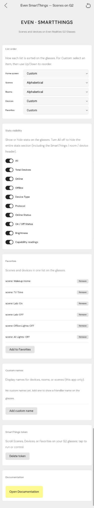
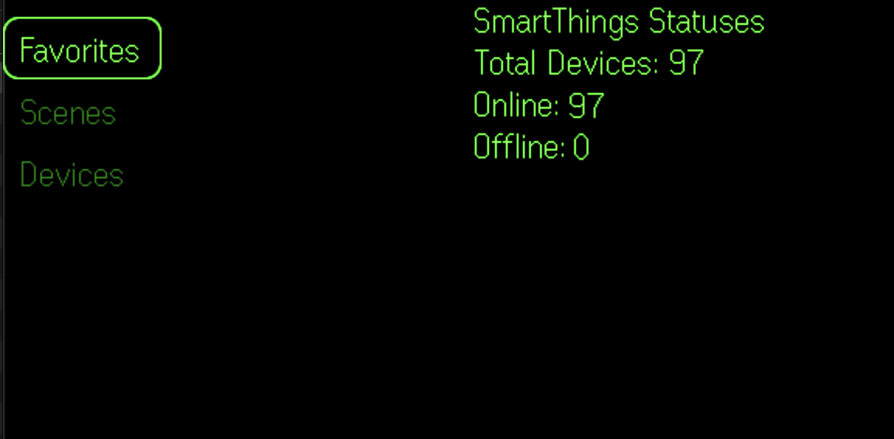
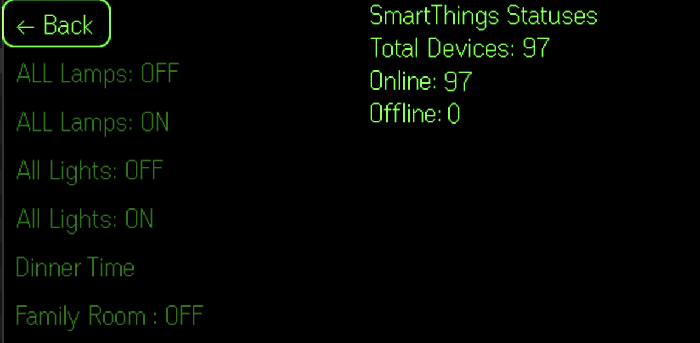
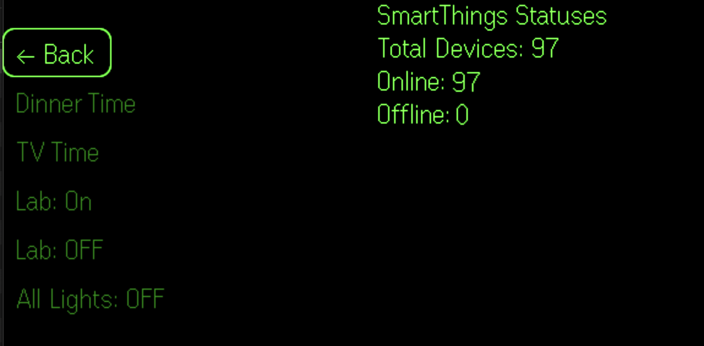
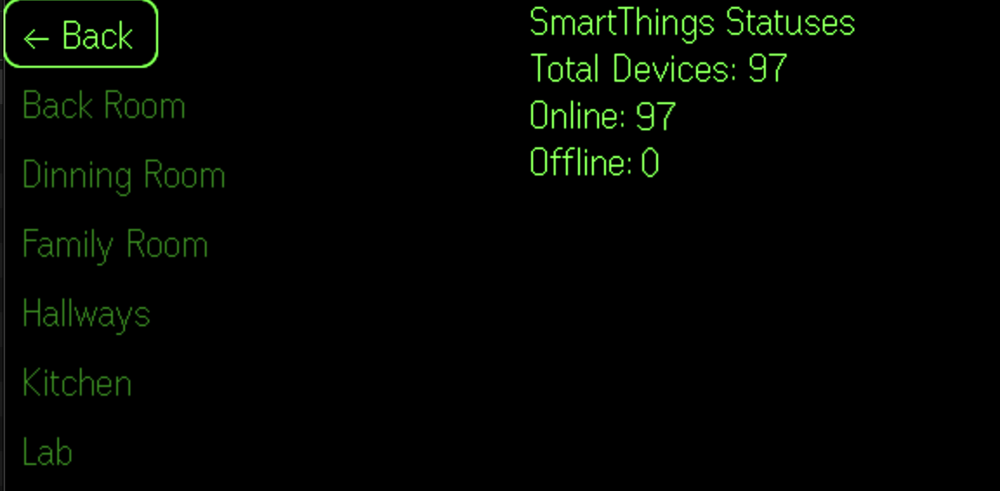
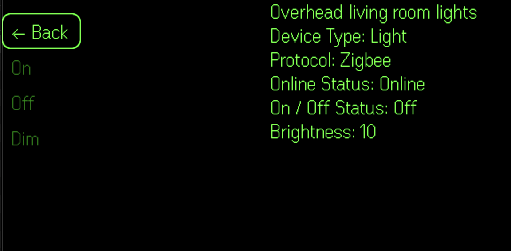
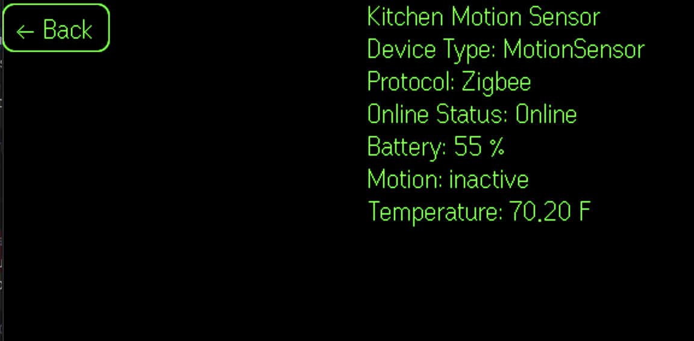
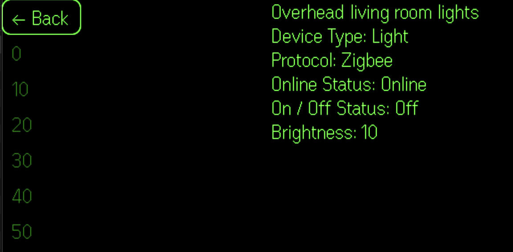

# SmartThings Controls

**Control SmartThings from your Even Realities G2 glasses.** Browse scenes, rooms, and devices in a list, then tap to run or control. Configure your SmartThings connection, list order, favorites, custom names, and stats visibility in the Even App config panel.

This project is licensed under the MIT License — see [LICENSE](LICENSE).

### Screenshots

| Config panel | Main menu (Favorites) | Scenes |
|--------------|------------------------|--------|
| [](screenshots/config.png) | [](screenshots/main-screen.png) | [](screenshots/scenes.png) |

| Favorites list | Rooms | Devices (lights) |
|-----------------|-------|-------------------|
| [](screenshots/favorites.png) | [](screenshots/rooms.png) | [](screenshots/devices-lights.png) |

| Device: motion sensor | Device: dimming |
|------------------------|------------------|
| [](screenshots/devices-motion-sensor.png) | [](screenshots/devices-dimming.png) |

*Config panel:* SmartThings connection, list order, stats visibility (including **All** toggle), favorites, custom names, and documentation. *On the glasses:* main menu (Scenes, Devices, and Favorites when favorites exist), scene list with SmartThings statuses, favorites list, rooms, device lists, device detail (e.g. motion sensor with battery/temperature), and dimming control.

---

## Features

- **Scenes** — Run any scene with one tap.
- **Devices** — Browse by room; tap to turn on/off or adjust dim level.
- **Favorites** — One list mixing scenes and devices; you choose what’s in it and the order.
- **Rooms** — Navigate by room, then control devices or run room actions.
- **Config panel** — Connect SmartThings, set list order (alphabetical, reverse, or custom), choose which stats show on the glasses, manage favorites, and set custom display names in the Even App.
- **Gesture navigation** — Single tap to select, double tap to go back, triple tap to jump to the last page.
- **G2-native UI** — List on the left, confirmation and stats on the right; scroll and tap drive everything.

---

## Tech stack

| Layer | Technology |
|-------|------------|
| Runtime | TypeScript, Vite 7 |
| Glasses | [Even Hub SDK](https://www.npmjs.com/package/@evenrealities/even_hub_sdk) (G2) |
| SmartThings | [SmartThings Core SDK](https://www.npmjs.com/package/@smartthings/core-sdk) |
| Node requirement | 20.19+ (LTS) or 22.12+ |

---

## Project structure

```
├── index.html          # Even App config UI (OAuth connect, list order, stats, favorites, renames) + “Open in Even App” fallback
├── src/
│   ├── bootstrap.ts    # Polyfills (Buffer, util) then main
│   ├── main.ts         # App bootstrap
│   ├── app.ts          # Backend session auth, SmartThings client bootstrap, G2 setup, events, display updates
│   ├── auth/
│   │   └── api.ts      # Frontend calls to the local OAuth backend
│   ├── evenhub/
│   │   └── bridge.ts   # Even Hub SDK bridge (init, setupPage, updateText, updateBoardImage, storage)
│   ├── input/
│   │   └── actions.ts  # Map Even Hub events to app tap actions
│   ├── render/
│   │   ├── composer.ts # G2 page layout (list + confirmation + stats containers)
│   │   ├── icon-data.ts   # Confirmation/status images (checkmark/exclamation/error) + BMP/PNG conversion
│   │   └── bmp-constants.ts
│   ├── state/          # Redux-style store, contracts, reducer, selectors, constants
│   └── debug-log.ts
├── api/                # Vercel Function entrypoints for OAuth/session/token routes
├── server/             # Shared OAuth/session handlers + local dev server + storage adapters
├── public/             # Static assets and doc.html
├── vercel.json         # Vercel build configuration
└── package.json
```

---

## Prerequisites

- **SmartThings** — An account plus a SmartThings OAuth client configured for this app’s redirect URI and scopes.
- **Even Realities** — G2 glasses and the Even App (to open the widget so it appears on your glasses).
- **Node.js** — v20.19+ (LTS) or v22.12+.

---

## Setup

1. **Clone and install**

   ```bash
   git clone https://github.com/dmyster145/SmartThingsControls.git
   cd SmartThingsControls
   npm install
   ```

2. **Use a supported Node version**

   ```bash
   nvm use
   ```

   If you do not use `nvm`, make sure `node -v` is `20.19+` or `22.12+`.

3. **Run locally**

   Start the backend first:

   ```bash
   npm run dev:server
   ```

   Then start Vite:

   ```bash
   npm run dev
   ```

   Port `5173` must be available. The local OAuth redirect URI is tied to that port by default, so if Vite tries to move to another port, stop it and free `5173` instead of using the alternate port.

4. **Open in the Even App**

   - Use [EvenHub CLI](https://www.npmjs.com/package/@evenrealities/evenhub-cli): run `npx @evenrealities/evenhub-cli qr` and scan with the Even App, or  
   - Open the dev URL (e.g. `http://<your-ip>:5173`) in the Even App’s in-app browser.

5. **Connect SmartThings**

   - On first load, the config panel shows **Connect SmartThings**.
   - Tap it to start the SmartThings OAuth flow.
   - After authorization, the backend stores the SmartThings refresh token and supplies fresh access tokens to the frontend when needed.

---

## OAuth Backend Scaffold

- Copy `.env.example` to `.env.local` and set your SmartThings OAuth client ID, client secret, and redirect URI.
- Start the backend with `npm run dev:server`.
- Start the frontend with `npm run dev`.
- In SmartThings, register the redirect URI shown in `SMARTTHINGS_REDIRECT_URI`. In local development that can be `http://<your-ip>:5173/api/auth/smartthings/callback` because Vite now proxies `/api` to the backend service.
- If you create the SmartThings OAuth-In app through the CLI, use `https://<your-domain>/api/smartapp` as the SmartApp `targetUrl` and `https://<your-domain>/api/auth/smartthings/callback` as the OAuth redirect URI.
- The scaffold exposes:
  - `GET /api/health`
  - `GET /api/session`
  - `POST /api/session/logout`
  - `GET /api/auth/smartthings/start`
  - `GET /api/auth/smartthings/callback`
  - `GET /api/smartthings/access-token`
  - `GET|POST /api/smartapp`
- Local development uses the file-backed store at `server/data/sessions.json`.
- Vercel production uses Redis storage when `KV_REST_API_URL` / `KV_REST_API_TOKEN`, `UPSTASH_REDIS_REST_URL` / `UPSTASH_REDIS_REST_TOKEN`, or `SMARTTHINGS_DB_REDIS_URL` is set.
- Session cookies are rolling by default: active users stay signed in, while inactive sessions expire after `SMARTTHINGS_CONTROLS_SESSION_TTL_SECONDS` (30 days by default).
- Current status: the frontend now authenticates through the backend session and fetches SmartThings access tokens from the OAuth service, whether it is running locally or in Vercel Functions.

---

## Usage on the glasses

- **Scroll** — Move the highlight in the list.
- **Tap** — Run or open the selected action: run a scene, open a room/device, toggle on/off, or change dim level.
- **Page controls** — Highlight `← Previous` / `Next →` and tap to move between pages.
- **Shortcuts** — Double tap to go back; triple tap to jump to the last page when available.
- The right side shows confirmation and stats (choose which stats in the config panel).

---

## Config panel (web)

Open the app in the Even App to configure:

- **List order** — Home, Scenes, Rooms, Devices, Favorites: alphabetical, reverse, or custom (reorder with Up/Down).
- **Stats visibility** — Choose which stats show on the glasses (e.g. total devices, online/offline, type, on/off, brightness).
- **Favorites** — Add scenes and devices to one “Favorites” list on the glasses.
- **Custom names** — Override display names for scenes, rooms, or devices (this app only).
- **SmartThings connection** — Connect, reconnect, or disconnect SmartThings (section is above Documentation).
- **Documentation** — Link to in-app docs (`doc.html`).

If you open the URL in a regular browser, you will see the **Open in Even App** panel.

---

## Build and deploy

```bash
npm run build
```

Frontend output is in `dist/`. On Vercel, the static frontend is served from `dist/` and the OAuth/token broker runs from the `api/` directory as Vercel Functions.

### Vercel deployment

1. Import the repository into Vercel.
2. Set the build command to `npm run build` if Vercel does not detect it automatically.
3. Set these environment variables in Vercel:
   - `SMARTTHINGS_CONTROLS_PUBLIC_APP_URL=https://<your-vercel-domain>`
   - `SMARTTHINGS_CLIENT_ID`
   - `SMARTTHINGS_CLIENT_SECRET`
   - `SMARTTHINGS_SCOPES`
   - `SMARTTHINGS_REDIRECT_URI=https://<your-vercel-domain>/api/auth/smartthings/callback`
4. Attach a Redis store and expose either:
   - `KV_REST_API_URL` and `KV_REST_API_TOKEN`, or
   - `UPSTASH_REDIS_REST_URL` and `UPSTASH_REDIS_REST_TOKEN`
   - `SMARTTHINGS_DB_REDIS_URL`
5. Register the exact HTTPS callback URL in SmartThings.

Notes:
- The Vercel deployment does not use `server/data/sessions.json`; that file only exists for local development.
- The OAuth `return_to` parameter is restricted to same-origin paths, so callback redirects stay inside the app.
- Cookies are marked `Secure` automatically when the request arrives over HTTPS.
- A standard `redis://...` connection string also works through `SMARTTHINGS_DB_REDIS_URL` if your Vercel integration provides that instead of REST-style Upstash variables.
- The SmartThings CLI should point its SmartApp webhook target to `https://<your-domain>/api/smartapp`, not the site root.
- A JSON template for `smartthings apps:create -i` is available at [smartthings/oauth-in-app.example.json](/Users/dustinharmon/development/Even_SmartThings/smartthings/oauth-in-app.example.json).

---

## Scripts

| Command | Description |
|---------|-------------|
| `npm run dev` | Start Vite dev server |
| `npm run dev:server` | Start the local OAuth backend in watch mode |
| `npm run server` | Start the local OAuth backend |
| `npm run build` | TypeScript build + Vite production build |
| `npm run preview` | Preview production build locally |
| `npm run lint` | Run ESLint on `src/`, `server/`, and `api/` |

---

## License

MIT — see [LICENSE](LICENSE).
